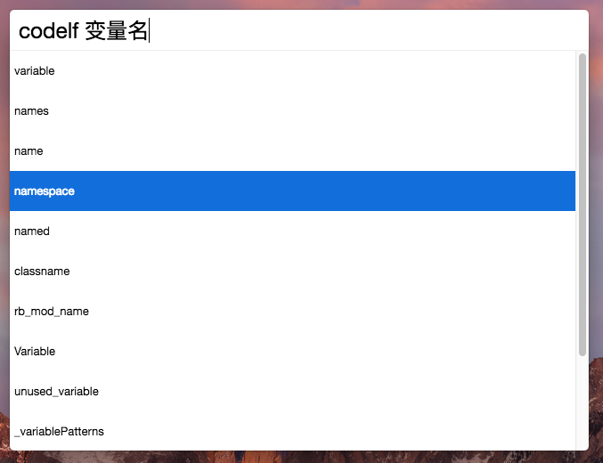
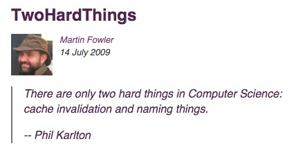

# cerebro-codelf

> There are only two hard things in Computer Science: cache invalidation and naming things. -- Phil Karlton

> 但是再也不用为起变量名而烦恼了

**Cerebro 变量名搜索插件**，项目灵感来源 [codelf](https://unbug.github.io/codelf/)。

## 安装

- <kbd>Ctrl-Space<kbd> 打开 Cerebro
- 输入 `plugins codelf`，点击安装

## 使用

- Cerebro 中，输入 `codelf` + `[待搜索的变量名]`；
- 上 <kbd>Up<kbd> 下 <kbd>Down<kbd> 选择变量名，敲回车 <kbd>Enter<kbd> 复制到剪切板；

